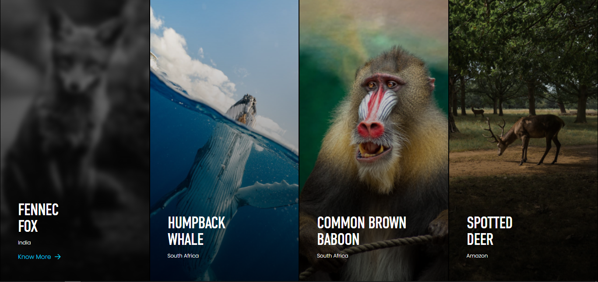

# Code of Africa Task Force Challenge

Welcome to the public repository for the Code of Africa Task Force Challenge. This repository contains the following components:

- [Interactive Photo Gallery](#interactive-photo-gallery) ([gallery](gallery))
- [First Coding Challenge](#first-coding-challenge) ([arrayMap.js](Challenges/arrayMap.js))
- [Second Coding Challenge](#second-coding-challenge) ([stringTransform.js](Challenges/stringTransform.js))

## Interactive Photo Gallery
The Interactive Photo Gallery is built using HTML, CSS, and JavaScript. The user interface design closely follows the provided design specifications, incorporating JavaScript for hover interactions, as demonstrated below.



Additionally, the [JavaScript code](gallery/scripts/index.js) allows users to individually display an image upon clicking.


The gallery is responsive across all device screens and maintains cross-browser functionality, ensuring a consistent experience in all modern browsers.

To access the interactive gallery, simply load the `index.html` file in your browser.

## First Coding Challenge
The first coding challenge focuses on array manipulation. It determines if a contiguous subarray within a given array sums up to a specified target. 

To run the provided JavaScript program, specify the array at the end of the [arrayMap.js](Challenges/arrayMap.js) file. You can execute the program using Node.js or a web browser:

- **Using Node.js**: Navigate to the directory containing `arrayMap.js` in your terminal and run:
  ```sh
  node arrayMap.js
  ```
- **Using a Web Browser**: Include the script in an HTML file and use the browser's Developer Tools Console to view the output.

An example input is provided within the file.

## Second Coding Challenge
The second coding challenge involves transforming a string based on its length. The [stringTransform.js](Challenges/stringTransform.js) script processes the string as follows:

- If the string's length is divisible by 3, the string is reversed.
- If the string's length is divisible by 5, each character is replaced with its ASCII code.
- If the string's length is divisible by 15, the string is first reversed, then each character is replaced with its ASCII code.

To run the program, specify your input string at the end of the `stringTransform.js` file. Then, use either Node.js or a web browser to execute the script:

- **Using Node.js**: Navigate to the directory containing `stringTransform.js` in your terminal and run:
  ```sh
  node stringTransform.js
  ```
- **Using a Web Browser**: Include the script in an HTML file and use the browser's Developer Tools Console to view the output.

This solution ensures the string transformation based on the specified rules and returns the expected result.

Thank you for exploring my work on the Code of Africa Task Force Challenge.
